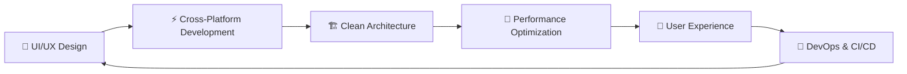

  <div align="center">

# Hi 👋, I'm Rahul Dange  

### _Full-Stack Mobile Engineer_ | _Flutter_ | _Cross-Platform_ | _DevOps_

  

[](https://rahuldange.dev)
[](https://linkedin.com/in/rahuldange)
[](https://x.com/rahuldange)
[](mailto:rahul@example.com)

  </div>

---

## 🎯 About Me

  <div align="center">

```dart
class RahulDange {
  final String role = "Full-Stack Mobile Engineer";
  final List<String> passions = [
    "Cross-Platform Development",
    "Mobile & Web Ecosystems",
    "Pixel-Perfect UI/UX",
    "Clean Architecture",
    "Performance Optimization",
    "DevOps & CI/CD"
  ];

  String get philosophy => "Design first, code smart, ship fast";

  void build() {
    print("🚀 Crafting experiences, not just apps");
  }
}
```

  </div>

---

## 🛠️ Tech Arsenal

  <div align="center">

### **Languages & Frameworks**


### **Mobile & Web Platforms**


### **Backend & Databases**


### **DevOps & CI/CD**


### **Monitoring & Analytics**


### **Development Tools**


  </div>

---

## 📊 GitHub Analytics

  <div align="center">

  
  

  </div>

  <div align="center">

[](https://git.io/streak-stats)

  </div>

  <div align="center">


  </div>

## 🏆 Achievements & Stats

  <div align="center">


**🔥 GitHub Streak:** Currently on fire!  
 **📱 Apps Built:** 10+ production apps  
 **👥 Users Impacted:** 100K+ downloads  
 **🏅 Code Quality:** Always striving for excellence

  </div>

---

## 🎯 Current Focus

  <div align="center">



  </div>

---

## 💡 Philosophy

  <div align="center">

> _"Code. Debug. Refactor. Repeat. That's my flow."_

**🎯 Mission:** Building mobile experiences that users love  
 **💪 Strength:** Turning complex problems into elegant solutions  
 **🚀 Vision:** Pushing the boundaries of mobile app development

  </div>

---

## 🌟 Fun Facts

  <div align="center">

- 🎮 **Anime Lover** - Love watching Anime
- ☕ **Coffee Addict** - Powered by caffeine and code
- 🎵 **Music Lover** - Coding with beats in the background
- 📚 **Continuous Learner** - Always exploring new technologies
- 🏃‍♂️ **Fitness Freak** - Balance between code and cardio

  </div>

---

  <div align="center">

### 🤝 Let's Connect!

**Ready to build something amazing together?**

[](https://rahuldange.dev)
[](https://linkedin.com/in/rahuldange09)

---

  

  </div>
